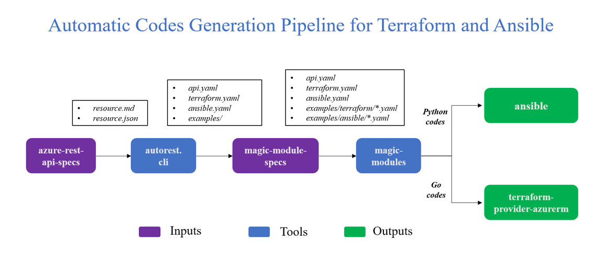

# A Tutorial of Automatic Codes Generation Pipeline for Terraform and Ansible


## Workflow
The automatic codes generation pipeline aims to generate codes for Terraform and Ansible automatically to provide Azure resources supports for the different automation tools. The workflow of the whole pipeline works as follows.


#### 1. azure-rest-api-specs

The repository [azure-rest-api-specs](https://github.com/Azure/azure-rest-api-specs) is the canonical source for REST API specifications for Microsoft Azure. It provides all the Azure resources definitions and their CRUD operations in _json_ form. Among all the services and resources, a quite large of them have not been enabled to support the automation tools. And this pipeline is designed to generate codes automatically for the unsupported resources.

#### 2. autorest.cli
The repository [autorest.cli](https://github.com/Azure/autorest.cli) is an intermediate tool. It accepts the _.md_ file (the paths of the _.json_ files are defined inside) as input and generate several _.yaml_ files as the outputs, which are used as the input files of _magic-modules_ later in the pipeline. 

The output files include 

* `api.yaml`, which is the core resource definition file that _magic-module_ needs to generate codes.
* `terraform.yaml`, which is an override file specifying adjustments or customizations for terraform.
* `ansible.yaml`, which is an override file specifying adjustments or customizations for ansible.
* `examples/*`, which includes the files used for generating test files and documents.

There are two different working ways to generate the intermediate files for the desired resources, either automatically or manually. For the former one, the tool runs on Travis and pull requests for _magic-module-specs_ automatically. For the latter one, users download the tool, run it locally and push the generated output files into _magic-module-specs_ manually.

#### 3. magic-module-specs
The repository [magic-module-specs](https://github.com/Azure/magic-module-specs) collects all the output files of _autorest.cli_ generated for _magic-modules_ and organizes them by resources. One resource corresponds to a folder in `magic-module-specs/specs/`, although there may be dependencies between different resources.

Due to the _autorest.cli_ function limitations, all other files are nearly blank and needs to be completed manually except for `api.yaml`, to make _magic-modules_ work properly. What's more, users will usually also be expected to modify the `api.yaml` file because of the mistakes and missings inside.

#### 4. magic-modules
The repository [magic-modules](https://github.com/VSChina/magic-modules) is a tool to generate codes to support Azure resources for Terraform and Ansible. It takes the resource input files in `magic-module-specs/specs/` as input, and generates the following files (use Terraform as an exmaple)

* `azurerm/resource.go`, which definines the schema and operations for the resource
* `azurerm/resource_test.go`, which is the test file of the resource
* `azurerm/datasource.go`, which defines the datasource of the resource
* `azurerm/datasource_test.go`, which is the test file of the datasource
* `website/docs/d/resource.html.markdown`, which is the document and usage example of the resource
* `website/docs/r/datasource.html.markdown`, which is the document and usage example of the datasource

_Magic-Modules_ also works in two ways. For the automatic way, it is included into _magic-module-specs_ as a sub-repository, generate codes and pull requests for Terraform and Ansible repositories automatically. For the manual way, users download the tool, generate codes, modifiy them locally and pull requests manually.

#### 5. terraform-provider-azurerm
The repository [terraform-provider-azurerm](https://github.com/VSChina/terraform-provider-azurerm) is forked from the official Terraform provider and is used as the working repository to pull requests for the official one. The auto-generated codes may need other manual changes to make it work properly, like client registering. All such modifications need to be done here before we pull a request to the official repository.


## Usage 
Two steps in general are needed to successfully generate codes for Terraform or Ansible. Firstly, using _autorest.cli_ to generate the _.yaml_ files for _magic-modules_. Secondly, using _magic-modules_ to generate _.go_ files and documents for the resource. We show them here.

#### 1. autorest.cli

##### Input File Format
The input for _autorest.cli_ is a _.md_ file. Inside the repository, you can find some input examples in `autorest.cli/inputs/`. When you want to generate a new resource's _*.yaml_ files, just copy one of them and modify it accordingly. Pay attention to at least the following points.

* `input-file` defines the _.json_ file path of the resource in _azure-rest-api-specs_, modify it to be the resource path you want to generate inside your _.md_ file.
* `disable-mm` controls whether to generate output files for _magic-modules_ as _autorest.cli_ is a tool not only for _magic-modules_, make sure it's set to be false.
* All other fields are just needed to be modified according to the resource you want to generate, like the _.md_ file's title, `cli-name`, `namespace` and `package-name`.

##### Steps and Commands
Firstly, install _Docker_ to make your environment prepared according to your operating system, ubuntu as an example [here](https://docs.docker.com/install/linux/docker-ce/ubuntu/).

When you want to generate the _*.yaml_ files for a new resource, these steps are usually needed. Note that after cloning the repositories, usually you need to write you own input file with _.md_ format and put it into the _autorest.cli/input/_ directory before building docker images. Because when building docker images, all the files in _autorest.cli_ repository will be added into the image. Alternatively, you can also choose to mount your input file when applying the docker running command, which will result in some changes to the command.

1. Cloning Repositories
```linux
cd ~
git clone https://github.com/Azure/azure-rest-api-specs
git clone https://github.com/Azure/autorest.cli
mkdir -p ~/autorest.cli.debug/generated
```

2. Building Docker Images
```linux
cd ~/autorest.cli/
sudo docker build --tag zikalino/autorest.cli.base -f Dockerfile-base .
sudo docker build --tag zikalino/autorest.cli .
```

3. Generating Files
```linux
sudo docker run -t -i
        -v ~/azure-rest-api-specs:/azure-rest-api-specs
        -v ~/autorest.cli.debug/generated:/generated
        zikalino/autorest.cli
        /autorest.cli/input/[your_resource].md
```

After above steps, you will expect to see the generated files in `autorest.cli.debug/generated/magic-modules-input`.

#### 2. magic-modules

##### Input File Format
The input files for _magic-modules_ are exactly the outputs of _autorest.cli_. However, these files are usually needed to be modified before they can be used to generate the functional codes, as we stated before. Usually, you are expected to check at least the following points.

* `api.yaml`. Make sure there are no validation errors by running the _magic-modules_ code generation commands below. You can find all the definitions about this file in [RESOURCE_SPEC.md](https://github.com/Azure/magic-module-specs/blob/master/RESOURCE_SPEC.md) when it needs to be modified.
* `terraform.yaml`. The original generated file is blank and needed to be completed to make the test files, data source files and documents can be successfully generated. Existing examples can be found in `magic-module-specs/specs/`.
* `examples/terraform/*`. Here you are expected to define the test files of your resource. Usually, a basic test case `basic.yaml` and a complete test case `complete.yaml` are needed. Still find examples in `magic-module-specs/specs/`.

##### Steps and Commands
Firstly, install _ruby_ on your machine with its version at lesat later than _Ruby 2.6.3-1_. The installation reference page is [here](https://www.ruby-lang.org/en/documentation/installation/). If the tool won't start because of a missing gem, then install it locally using _bundler_ according to the error prompt.

_Magic-Modules_ is a tool originally developed for GCP. Note to download it from our forked repository for Azure and checkout to the correct branch. The code generation steps are shown here.

1. Cloning Repository
```linux
cd ~
git clone https://github.com/VSChina/magic-modules/
cd ~/magic-modules/ && git checkout azure_backend
```

2. Generating Codes
```linux
bundle exec compiler.rb -e terraform -c azure -p [your_resource_dir] -o [your_output_dir]
```

After above steps, you will expect to see the code files are generated in `[your_output_dir]`.

#### 3. terraform-provider-azurerm
When codes are successfully generated, we need to verify whether they can work properly with Terraform. Get yourself ready for Terraform [here](https://www.terraform.io/docs/index.html) if you are not familiar with it. As we are developing a provider for Terraform, these sections in the document are highly recommended to read

* Terraform Configuration Language, the reference is [here](https://www.terraform.io/docs/configuration/index.html).
* Terraform Plugins, the reference is [here](https://www.terraform.io/docs/plugins/index.html).
* Extending Terraform, the reference is [here](https://www.terraform.io/docs/extend/index.html).

The basic goal here is to setup an environment for provider developing. When it is prepared, move on to test whether the generated codes will work well or not by the following steps.

##### 1. Test the .go Files
Move yor generated _.go_ files into the same directory in _terraform-provider-azurerm_ . Run the following commmands to build your resource into the provider. Go back to check and modify your _*.yaml_ files if errors occur.
```linux
cd [home of terraform-provider-azurerm]
goimports -w azurerm/[your_resource].go
goimports -w azurerm/[your_resource]_test.go
make build
```

##### 2. Test the \_test.go Files

It’s important to note that acceptance tests in Terraform create actual cloud infrastructure, which verifies the described behavior of Terraform Plugins in real world use cases against the actual APIs, and verifies both local state and remote values match. Terraform requires the follwing environment variables be set in order to run acceptance tests for Azure.

```linux
# Terraform AccTest
export TF_ACC = true

# Azure Credentials
export ARM_CLIENT_ID = ...
export ARM_CLIENT_SECRET = ...
export ARM_SUBSCRIPTION_ID = ...
export ARM_TENANT_ID = ...
```

When the environment is prepared, run the command below to test the new generated resource. We can assume the new resource works well now if both basic and complete test cases can pass.

```linux
cd [home of terraform-provider-azurerm]/azurerm
go test -run [test_func_name] -v
```
## Manual Adjustments

Due to the inevitable errors and limitations in _api.yaml_ file, _magic-modules_ provides the _terraform.yaml_ to override the _api.yaml_ file. It's also a way to control the outputs of the code generation, for exmaple, customizing the acceptance tests, datasources, and documents. In the follwing, we describe the common formats and show the usages of the _terraform.yaml_ file. We'll take the batch account resource as an example, and you can find its _terraform.yaml_ [here](https://github.com/Azure/magic-module-specs/blob/master/specs/batchaccount/terraform.yaml).

The original _autorest.cli_ generated _terraform.yaml_ file is almost empty and changes nothing in _api.yaml_, which typically looks like the block here.

```yaml
--- !ruby/object:Provider::Azure::Terraform::Config
overrides: !ruby/object:Overrides::ResourceOverrides
  BatchAccount: !ruby/object:Provider::Azure::Terraform::ResourceOverride
    properties: {}
```

You are expected to complete the _terraform.yaml_ file. A complete _terraform.yaml_ file includes `overrides` field which redefines the properties in _api.yaml_, and `datasources` field which controls the datasource codes generation. Usually, the sub-fields below will cover most of the usecases. It's important to note that all of them are optional, but at least one sub-field is needed to make the _ResourceOverride_ object valid.

```yaml
--- !ruby/object:Provider::Azure::Terraform::Config
overrides: !ruby/object:Overrides::ResourceOverrides
  BatchAccount: !ruby/object:Provider::Azure::Terraform::ResourceOverride
    azure_sdk_definition: {...}
    properties: {...}
    custom_code: {...}
    acctests: {...}
    document_examples: {...}
datasources: !ruby/object:Overrides::ResourceOverrides
  BatchAccount: !ruby/object:Provider::Azure::Terraform::ResourceOverride
    azure_sdk_definition: {...}
    properties: {...}
    custom_code: {...}
    acctests: {...}
    datasource_example_outputs: {...}
```

##### 1. azure_sdk_definition

The sub-field `azure_sdk_definition` in _terraform.yaml_ is designed to override the settings in `azure_sdk_definition` in _api.yaml_. However, we only support to override `create`, `read`, `update` and `delete` now (other root properties of `azure_sdk_definition` like `provider_name` are not supported yet). Below is an example we rename the `go_variable_name` in the request of `create` operation.

```yaml
azure_sdk_definition: !ruby/object:Api::Azure::SDKDefinitionOverride
  create: !ruby/object:Api::Azure::SDKOperationDefinitionOverride
    request:
      'resourceGroupName': !ruby/object:Api::Azure::SDKTypeDefinitionOverride
        go_variable_name: resourceGroupName
```

Besides, you can also add additional fields for a property that are designed for _api.yaml_ (see [RESOURCE_SPEC.md](https://github.com/Azure/magic-module-specs/blob/master/RESOURCE_SPEC.md)) in the _terraform.yaml_ here.

```yaml
azure_sdk_definition: !ruby/object:Api::Azure::SDKDefinitionOverride
  create: !ruby/object:Api::Azure::SDKOperationDefinitionOverride
    request:
      '/properties/autoStorage/storageAccountId': !ruby/object:Api::Azure::SDKTypeDefinitionOverride
        empty_value_sensitive: true
```

Finally, a field `remove` which is only designed for _terraform.yaml_ can be set here to remove the property.

```yaml
azure_sdk_definition: !ruby/object:Api::Azure::SDKDefinitionOverride
  create: !ruby/object:Api::Azure::SDKOperationDefinitionOverride
    request:
      '/properties/autoStorage/storageAccountId': !ruby/object:Api::Azure::SDKTypeDefinitionOverride
        remove: true
```

##### 2. properties

The sub-field `properties` in _terraform.yaml_ is very similar with `azure_sdk_definition`, which aims to override the `properties` field in _api.yaml_.

You can override a property's key-value by first setting the property to be a `!ruby/object:Provider::Azure::Terraform::PropertyOverride` type and then list the modified value below. The following example changes the name of the original property.

```yaml
properties:
  autoStorageAccountId: !ruby/object:Provider::Azure::Terraform::PropertyOverride
    name: storageAccountId
```

Likewise, you can also list additional key-value pairs that are designed for _api.yaml_ here (see [RESOURCE_SPEC.md](https://github.com/Azure/magic-module-specs/blob/master/RESOURCE_SPEC.md) for the supported key-value types in _api.yaml_).

```yaml
properties:
  autoStorageAccountId: !ruby/object:Provider::Azure::Terraform::PropertyOverride
    input: true
```

Finally, `properties` provides rich choices that are only designed for _terraform.yaml_, which is covered in the advanced topics. We give an example to customize the validation function of a property here.

```yaml
properties:
  autoStorageAccountId: !ruby/object:Provider::Azure::Terraform::PropertyOverride
    validation: !ruby/object:Provider::Terraform::Validation
      function: azure.ValidateResourceIDOrEmpty
```

##### 3. custom_code

The `custom_code` is a _terraform.yaml_ specified sub-field and usually needs to work with `properties` to enable code customizations. In the following is an example that we use `custom_code` and `properties` to customize the validation function of property `name` in resource BatchAccount.
```yaml
properties:
  name: !ruby/object:Overrides::Terraform::PropertyOverride
    validation: !ruby/object:Provider::Terraform::Validation
      function: validateAzureRMBatchAccountName
custom_code: !ruby/object:Provider::Azure::Terraform::CustomCode
  extra_functions: ./terraform_extra_functions.erb
```
```go
// file name: terraform_extra_functions.erb
func validateAzureRMBatchAccountName(v interface{}, k string) (warnings []string, errors []error) {
    value := v.(string)
    if !regexp.MustCompile(`^[a-z0-9]+$`).MatchString(value) {
        errors = append(errors, fmt.Errorf("letters and numbers only are allowed in %q: %q", k, value))
    }

    if 3 > len(value) {
        errors = append(errors, fmt.Errorf("%q cannot be less than 3 characters: %q", k, value))
    }

    if len(value) > 24 {
        errors = append(errors, fmt.Errorf("%q cannot be longer than 24: %q %d", k, value, len(value)))
    }

    return warnings, errors
}
```

The `custom_code` field also provides rich sub-fields for users to customize codes, which are coverd in the advanced topics.

##### 4. acctests

The `acctests` is used to generate the test cases in _\_test.go_ together with `examples/terraform/*.yaml` files. Therefore, when you add the `acctests` field, make sure the corresponding `*.yaml` files are provided. In the following example, `name: basic` specifies the test function name, and `steps: [basic]` finds the `examples/terraform/basic.yaml` file to form the _Steps_ of _resource.ParallelTest_ in test function.

```yaml
acctests:
  - !ruby/object:Provider::Azure::Terraform::AccTestDefinition
    name: basic
    steps: [basic]
```

Usually, we need the following three test cases when generating a new resource. The _basic_ case tests whether the new resource can be deployed by setting only the required properties. The _complete_ case tests whether it can be deployed with all of its properties setted. The _update_ case tests whether the resource can be updated from a state with basic properties to a state with complete properties.

```yaml
acctests:
  - !ruby/object:Provider::Azure::Terraform::AccTestDefinition
    name: basic
    steps: [basic]
  - !ruby/object:Provider::Azure::Terraform::AccTestDefinition
    name: complete
    steps: [complete]
  - !ruby/object:Provider::Azure::Terraform::AccTestDefinition
    name: update
    steps: [basic, complete]
```

Now, we use the BatchAccount resource to explain the how to write an `example/terraform/*.yaml` file. The `resource` defines the Azure resource name in Terraform. The `prerequisites` lists the resource dependencies, inside of which the `product` and `axample` are used to locate the dependent resource by `<product>/terraform/<example>.yaml`. The dependent resources are not always exist, remember to first write the dependent resources' _basic.yaml_ files and then move on to your resource. The `properties` lists the properties we set for the resource when testing. All the properties of the resource are needed in a `complete.yaml` but only the required ones are needed in a `basic.yaml`.

```yaml
--- !ruby/object:Provider::Azure::Example
resource: azurerm_batch_account
prerequisites:
  - !ruby/object:Provider::Azure::ExampleReference
    product: resourcegroup
    example: basic
  - !ruby/object:Provider::Azure::ExampleReference
    product: storageaccount
    example: basic
properties:
  name: "<%= get_resource_name('batchAccounts', 'batch') -%>"
  resource_group_name: ${azurerm_resource_group.<%= resource_id_hint -%>.name}
  location: ${azurerm_resource_group.<%= resource_id_hint -%>.location}
  poolAllocationMode: BatchService
  storageAccountId: ${azurerm_storage_account.<%= resource_id_hint -%>.id}
```

For convenience, we support _erb_ code blocks in the `example/terraform/*.yaml` files by declaring them in `<%= ... -%>`. And we provide the function _get_resource_name(param1, param2)_ which returns a string `acctest#{param2}-%d` when generating _\_test.go_ file. The value of variable `resource_id_hint` is always `test` among differen resources to make sure the resource reference is valid.

The complete defintions of `acctests` and `examples/terraform/*.yaml` files are covered in advanced topics.

##### 5. document_examples

The `document_examples` is used to generate the documents of the resource. The `title` specifies the title of the usage example. The `example_name` chooses to use the example defined in `example/terraform/<example_name>.yaml`. The `resource_name_hints` provides candidate values for the properties used in the example. When generating documents, the function _get_resource_name(param1, param2)_ returns `resource_name_hints[param1]` if `param1` exists in `resource_name_hints`, it works differently with generating test files because we need random values in testing but fixed values in documents.

```yaml
document_examples:
  - !ruby/object:Provider::Azure::Terraform::DocumentExampleReference
    title: Example Usage
    example_name: basic
    resource_name_hints:
      resourceGroups: example-rg
      storageAccounts: examplesa
      batchAccounts: example-batch-account
      location: West US
```

The `document_examples` field in `overrides` is also valid for `datasource`, which means _magic-modules_ will generate documents for both _resource.go_ and _datasource.go_ files once `document_examples` is set and you don't need to add this field in `datasource` any more.

##### 6. datasource_example_outputs

The `datasource_example_outputs` controls generating `output` block in the Terraform datasource example, you can specify the properties you want to extract from the `data` block here.

```yaml
datasource_example_outputs:
  batch_id: id
```

## Advanced Topics
##### 1. Complete definitions of azure_sdk_definition
```
- azure_sdk_definition  (type: SDKDefinitionOverride)
    - create            (type: SDKOperationDefinitionOverride)
    - request           (type: Hash, key_type: String, item_type: SDKTypeDefinitionOverride)
      # terraform.yaml specified fields
      - remove          (type: boolean, default: false)
    - response          (type: Hash, key_type: String, item_type: SDKTypeDefinitionOverride)
    - read              (type: SDKOperationDefinitionOverride)
    - update            (type: SDKOperationDefinitionOverride)
    - delete            (type: SDKOperationDefinitionOverride)
```

##### 2. Complete definitions of properties

The field `properties` in _terraform.yaml_ provides rich choices for you to adjust your codes. We list a complete list of all the options here. All of them are optional in the `properties`.

```
properties:                   (type: Hash)
  - <property_name>: !ruby/object:Overrides::Terraform::PropertyOverride
    # terraform.yaml specified fields
    - diff_suppress_func      (type: String)
    - state_func              (type: String)
    - sensitive               (type: boolean, default: false)
    - ignore_read
    - validation
      - regex                 (type: String)
      - function              (type: String)
    - unordered_list          (type: boolean, default: false)
    - is_set                  (type: boolean, default: false)
    - set_hash_func           (type: String)
    - default_from_api        (type: boolean, default: false)
    - schema_config_mode_attr (type: boolean, default: false)
    - conflicts_with
    - update_mask_fields
    - flatten_object
    - custom_expand           (type: String)
    - custom_flatten          (type: String)
```

* `diff_suppress_func`: The field adds a _DiffSuppressFunc_ to the schema. 

* `state_func`: The field adds a _StateFunc_ to the schema. The `sensitive` adds `Sensitive: true` to the schema. 

* `ignore_read`: The field does not set this value to the returned API value, and it's useful for fields like secrets where the returned API value is not hel. 

* `validation`: The field adds a ValidateFunc to the schema, where `regex` ensures the value matches this regex and `function` shows the name of the _ValidateFunc_. 

* `unordered_list`: The field indicates that this is an Array that should have Set diff semantics. 
* `is_set`: The field uses a Set instead of an Array. 

* `set_hash_func`: The field sets optional function to determine the unique ID of an item in the set. If not specified, `schema.HashString` (when elements are string) or `schema.HashSchema` are used. 

* `default_from_api`: The field sets the field to both _Computed_ and _Optional_ in the schema.

* `schema_config_mode_attr`: The field applies a _ConfigMode_ of _SchemaConfigModeAttr_ to the field. This should be avoided for new fields, and only used with old ones. (see [here](https://github.com/hashicorp/terraform/pull/20837))

* `conflicts_with`: The field shows names of attributes that can't be set alongside this one.

* `update_mask_fields`: The field shows names of fields that should be included in the updateMask.


The following settings involves schema modifications. Schema modifications change the schema of a resource in some fundamental way. They're not very portable and will be hard to generate so we should limit their use. Generally, if you're not converting existing Terraform resources, these shouldn't be used.

The `flatten_object` field flattens a NestedObject by removing that field from the Terraform schema but will preserve it in the JSON sent/retreived from the API. For example, a API schema where fields are nested (eg: `one.two.three`) and we desire the properties of the deepest nested object (eg: `three`) to become top level properties in the Terraform schema. By overidding the properties `one` and `one.two` and setting `flatten_object` then all the properties in `three` will be at the root of the TF schema.

We need this for cases where a field inside a nested object has a default, if we can't spend a breaking change to fix a misshapen field, or if the UX is much better otherwise. It's important to note that only fully flattened properties are currently supported. In the example above you could not flatten `one.two` without also flattening all of it's parents such as `one`

The following fields involves codes customization. Note that All custom code attributes are string-typed.  The string should be the name of a template file which will be compiled in the specified / described place.

A custom expander (`custom_expand`) replaces the default expander for an attribute. It is called as part of Create, and as part of Update if object.input is false.  It can return an object of any type, so the function header is part of the custom code template. As with flatten, `property` and `prefix` are available.

A custom flattener (`custom_flatten`) replaces the default flattener for an attribute. It is called as part of Read. It can return an object of any type, and may sometimes need to return an object with non-interface{} type so that the d.Set() call will succeed, so the function header is a part of the custom code template.  To help with creating the function header, `property` and `prefix` are available, just as they are in the standard flattener template.


##### 3. Complete definitions of custom_code
The field `custom_code` in _terraform.yaml_ also provides rich choices for you to customize your codes. We list a complete list of all the options here. All of them are optional in `custom_code`.

```
- custom_code             (type: CustomCode)
  - !ruby/object:Provider::Azure::Terraform::CustomCode
    - extra_schema_entry  (type: String)
    - resource_definition (type: String)
    - encoder             (type: String)
    - update_encoder      (type: String)
    - decoder             (type: String)
    - constants           (type: String)
    - post_create         (type: String)
    - pre_update          (type: String)
    - post_update         (type: String)
    - pre_delete          (type: String)
    - custom_delete       (type: String)
    - custom_import       (type: String)
    - post_import         (type: String)
    
    # Azure specified fields
    - post_read           (type: String)
    - extra_functions     (type: String)
```

All custom code attributes are string-typed. The string should be the name of a template file which will be compiled in the specified / described place.

* `extra_schema_entry`: Extra schema entries go below all other schema entries in the resource's _Resource.Schema_ map.  They should be formatted as entries in the map, e.g. `"foo": &schema.Schema{ ... },`.

* `resource_definition`: Resource definition code is inserted below everything else in the resource's Resource {...} definition.  This may be useful for things like a MigrateState / SchemaVersion pair. This is likely to be used rarely and may be removed if all its use cases are covered in other ways.

* `encoder`: The encoders are functions which take the `obj` map after it has been assembled in either "Create" or "Update" and mutate it before it is sent to the server.  There are lots of reasons you might want to use these - any differences between local schema and remote schema will be placed here. Because the call signature of this function cannot be changed, the template will place the function header and closing } for you, and your custom code template should not include them.

* `update_encoder`: The update encoder is the encoder used in Update - if one is not provided, the regular encoder is used.  If neither is provided, of course, neither is used.  Similarly, the custom code should not include the function header or closing }. Update encoders are only used if object.input is false, because when object.input is true, only individual fields can be updated - in that case, use a custom expander.

* `decoder`: The decoder is the opposite of the encoder - it's called after the Read succeeds, rather than before Create / Update are called.  Like with encoders, the decoder should not include the function header or closing }.

* `constants`: Constants go above everything else in the file, and include things like methods that will be referred to by name elsewhere (e.g. "fooBarDiffSuppress") and regexes that are necessarily exported (e.g. "fooBarValidationRegex").

* `post_create`: This code is run after the Create call succeeds.  It's placed in the Create function directly without modification.

* `pre_update`: This code is run before the Update call happens.  It's placed in the Update function, just after the encoder call, before the Update call.  Just like the encoder, it is only used if object.input is false.

* `post_update`: This code is run after the Update call happens.  It's placed in the Update function, just after the call succeeds. Just like the encoder, it is only used if object.input is false.

* `pre_delete`: This code is run just before the Delete call happens.  It's useful to prepare an object for deletion, e.g. by detaching a disk before deleting it.

* `custom_delete`: This code replaces the entire delete method.  Since the delete method's function header can't be changed, the template inserts that for you do not include it in your custom code.

* `custom_import`: This code replaces the entire import method.  Since the import method's function header can't be changed, the template inserts that for you do not include it in your custom code.

* `post_import`: This code is run just after the import method succeeds - it is useful for parsing attributes that are necessary for the Read() method to succeed.

* `post_read`: This code is run after the Read call succeeds and before setting schema attributes. It's placed in the Read function directly without modification.

* `extra_functions`: This code snippet will be put after all CRUD and expand/flatten functions of a Terraform resource without modification.

##### 4. Complete definitions of acctests

```
- acctests        (type: Array, item_type: AccTestDefinition)
  - !ruby/object:Provider::Azure::Terraform::AccTestDefinition
    - name        (type: String, required: true)
    - steps       (type: Array, item_type: String, required:true)
```

```
- !ruby/object:Provider::Azure::Example
  - resource      (type: String, required: true)
  - description   (type: String)
  - prerequisites
    - product     (type: String)
    - example     (type: String, required: true)
  - properties    (type: Hash, required: true)
```

##### 5. Complete definitions of document_examples

```
- document_examples         (type: Array, item_type: DocumentExampleReference)
  - !ruby/object:Provider::Azure::Terraform::DocumentExampleReference
    - title                 (type: String, required: true)
    - example_name          (type: String, required: true)
    - resource_name_hints   (type: Hash, key_type: String, item_type: String)
```

##### 6. Complete definitions of datasource_example_outputs

```
- datasource_example_outputs  (type: Hash)
```
## Frequent Questions

##### 1. How to add an empty string parameter in the request functions of the resource's client?

See the solution [here](https://github.com/VSChina/magic-modules/issues/21).

##### 2. How to flatten the structure of properties in api.yaml?

See the solution [here](https://github.com/VSChina/magic-modules/issues/37).

##### 3. How to customize the properties to be checked in test file?

See the solution [here](https://github.com/VSChina/magic-modules/issues/25).

##### 4. How to customize the validation functions in schema?

See the solution [here](https://github.com/VSChina/magic-modules/issues/44).

##### 5. How to set a property to be both optional and computed?

See the solution [here](https://github.com/VSChina/magic-modules/issues/22).

##### 6. How to override a multi-layer property?

See the solution [here](https://github.com/VSChina/magic-modules/issues/45).

##### 7. How to add the resource_name_hints in document_examples?

See the solution [here](https://github.com/VSChina/magic-modules/issues/46).